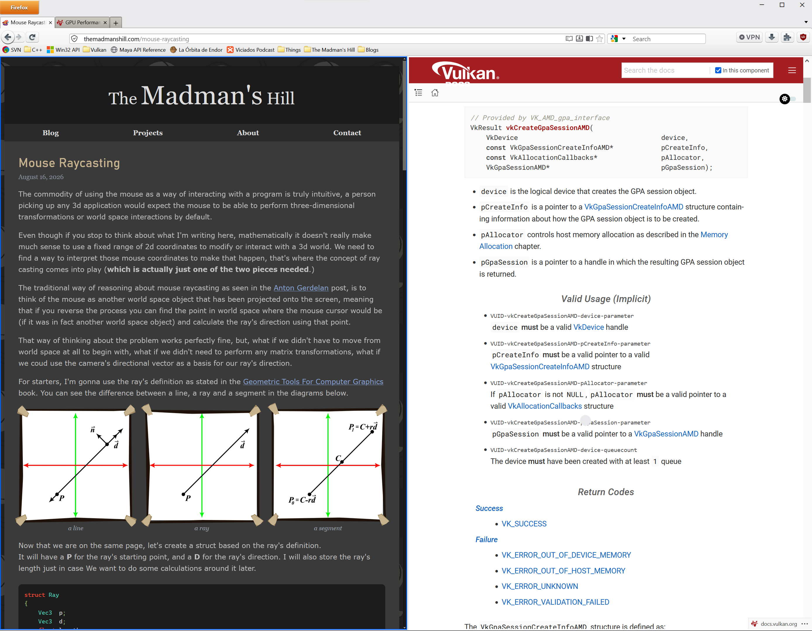
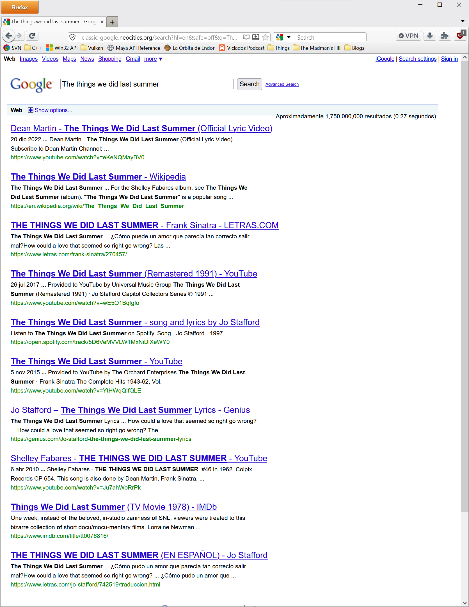
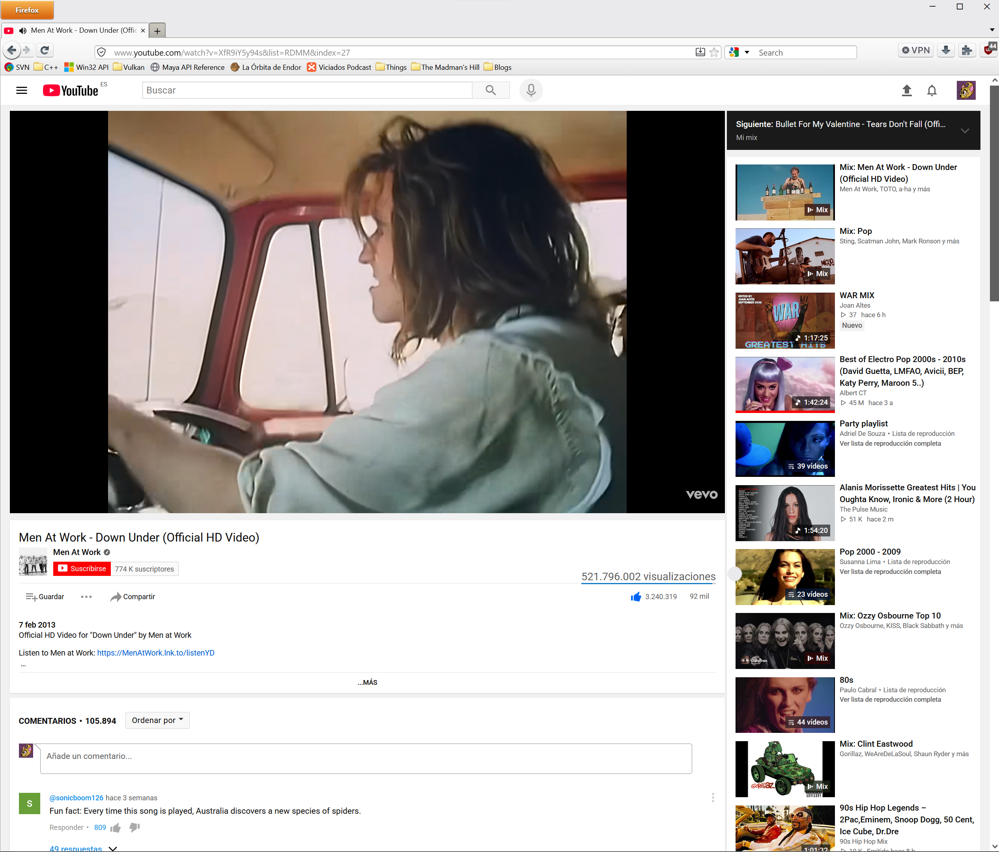

# Firefox-Classic-Theme-155
## Installation

In a new tab, type **about:config** in the address bar and press Enter. Click the button accepting the risk. Search for **toolkit.legacyUserProfileCustomizations.stylesheets** and switch it's value from false to true.

Then in a new tab write **about:support**. 
Open the profile folder and paste the chrome folder inside it.

Enjoy.

## Notes
For a better experience:
 - Right click on the title bar, and enable the **Menu bar** option.
 - Set bookmarks toolbar to **"Always Show"**.

## Screenshots
| New Page with and Old History Menu                  | Working Split Tabs                                |
|:---------------------------------------------------:|:--------------------------------------------------:
|  |             |

| Surfing the Web as if it was 2011                   | Surfing the Web as if it was 2011                 |
|:---------------------------------------------------:|:--------------------------------------------------:  
|                            |                          |
